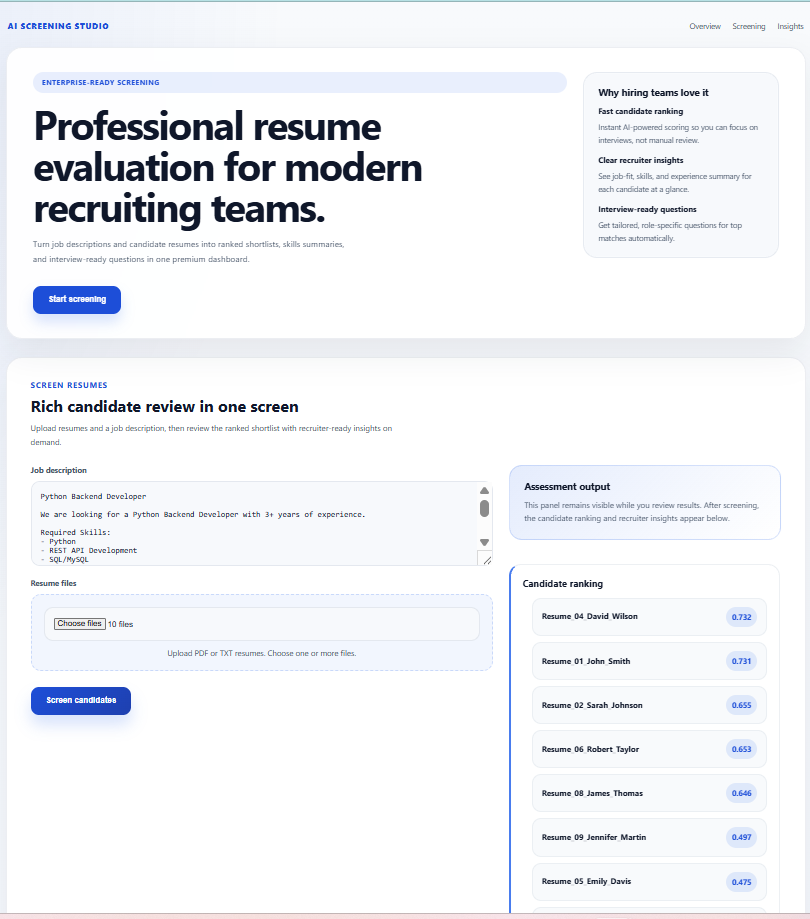

# AI Resume Screening Agent

An LLM-powered recruitment tool that ranks job candidates by fit. Upload a job
description and a set of resumes (PDFs) through the browser, and the agent ranks
candidates using semantic matching (embeddings), extracts each top candidate's
skills, and generates tailored interview questions — all in real time.

> Built with Python, FastAPI, sentence-transformers, and Groq. Demonstrates a
> Retrieval-Augmented Generation (RAG) pipeline: embed, match by meaning, then
> generate.

---

## Demo

<!--
  ADD A SCREENSHOT HERE (most important part of the README):
  1. Run the app, upload a JD + a few resumes, screen them.
  2. Take a screenshot showing the ranking + a candidate's skills/questions.
  3. Save it in this repo as screenshot.png — the line below displays it.
-->


---

## What it does

- Accepts a **job description** and **resume PDFs uploaded live** in the browser.
- Ranks every candidate by how well they match the job — using **meaning**, not just
  keywords (semantic matching via embeddings + cosine similarity).
- For the top candidates, uses an LLM to **extract their key skills** (as structured
  data) and **generate tailored interview questions**.
- Returns a ranked report instantly.

## How it works (the RAG pipeline)

```
Recruiter uploads job description + resume PDFs (live)
        |
   [LOADING]     PDF bytes -> text
        |
   [EMBEDDING]   each resume + the job description -> meaning vectors (~384 numbers)
        |
   [SIMILARITY]  cosine similarity: job vector vs each resume vector
        |
   [RANKING]     sort candidates best-fit first
        |
   [GENERATION]  LLM extracts skills + writes interview questions for the top few
        |
   Ranked report shown in the browser
```

The embedding + similarity steps match a resume to the job by *meaning* — so a resume
that says "scalable backend systems" matches a job asking to "build APIs" even though
the words differ. The LLM is used only for the language tasks (skills, questions).

## Tech stack

| Layer | Technology |
| --- | --- |
| Language | Python |
| Embeddings | sentence-transformers (all-MiniLM-L6-v2, runs locally) |
| LLM | Groq (Llama 3.3) — OpenAI-compatible API |
| Similarity | cosine similarity |
| API / uploads | FastAPI (live file upload) |
| Frontend | HTML + JavaScript |
| PDF reading | pypdf |

## Concepts demonstrated

Embeddings, cosine similarity, semantic search, RAG-style retrieval/ranking,
structured output (skills as JSON), LLM generation, temperature control, and
real-time file upload handling.

---

## Running it locally

### 1. Setup

```bash
git clone https://github.com/DhivyaSR/resume-screening-agent.git
cd resume-screening-agent
python -m venv venv
venv\Scripts\activate          # Windows
# source venv/bin/activate     # Mac/Linux
pip install -r requirements.txt
```

### 2. Add your Groq API key

Create a `.env` file:

```
GROQ_API_KEY=your_groq_key_here
```

(A free key is available at console.groq.com — no credit card required.)

### 3. Run

```bash
uvicorn main:app --reload
```

Open **http://localhost:8000**, paste a job description, upload a few resume PDFs,
and click **Screen Candidates**.

### Or with Docker

```bash
docker compose up -d --build
```

---

## Project structure

```
resume-screening-agent/
├── main.py          # FastAPI app — receives live uploads, runs the pipeline
├── screening.py     # loading (PDF->text), embedding, similarity, ranking
├── agent.py         # LLM generation: skill extraction + interview questions
├── index.html       # browser UI with live file upload
├── requirements.txt
├── Dockerfile
└── docker-compose.yml
```

---

## Example

**Job description:** *"Senior AI/Backend Engineer — strong Python, FastAPI, APIs,
Docker; bonus: LLMs, RAG, embeddings."*

**Result:** backend/ML candidates rank at the top with high fit scores; a frontend
candidate ranks lower — matched by *meaning*, without keyword matching. The top
candidates come back with extracted skills and tailored interview questions.

---

## How it scales (bulk resumes)

Ranking is cheap (embeddings run locally), so hundreds of resumes can be scored
quickly. The expensive LLM step (skills + questions) runs only on the **top
candidates**, keeping it fast and within API limits — the same pattern real screening
tools use.

---

## Notes

- Embedding and similarity run locally and free; only the skill/question generation
  calls the LLM API.
- The `.env` file holds the API key and is never committed (gitignored).
- Scanned/image-only PDFs have no text layer and would require OCR — out of scope here.

---

## About

Built while transitioning from PHP/MySQL backend development into AI application
development. It demonstrates the core RAG pattern — matching by meaning, then
generating — applied to a real recruitment problem.
